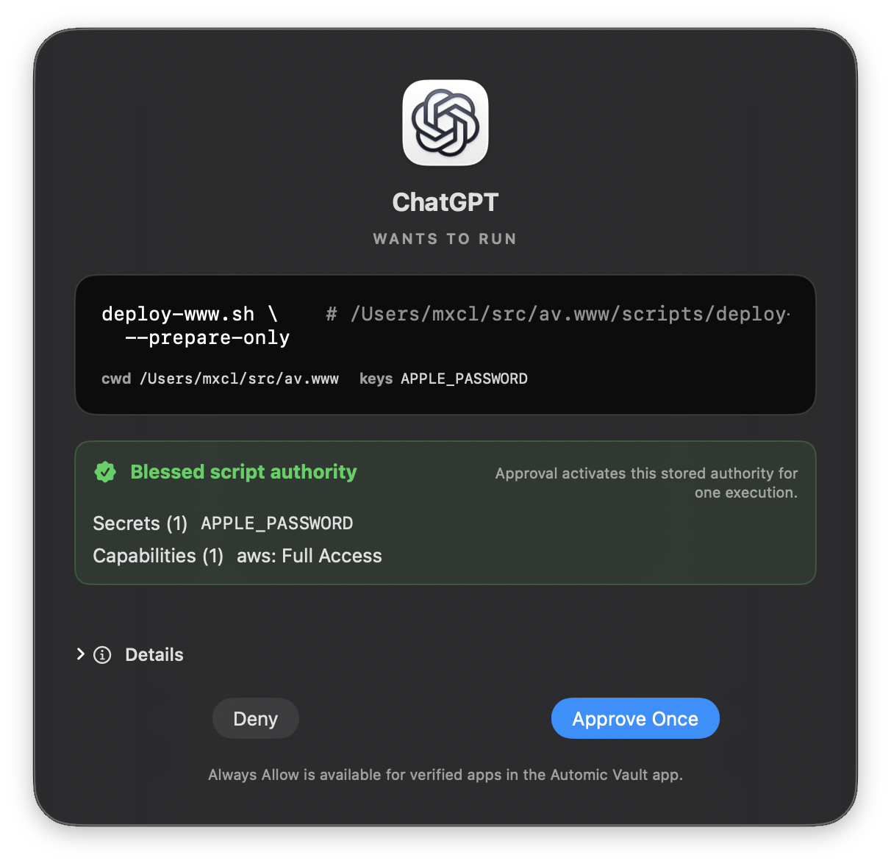

# Automic Vault

> A new kind of secrets manager for a new era of development.

## Quickstart

- Direct download: \
  https://github.com/automic-vault/automic-vault/releases/latest
- Homebrew:
  ```sh
  brew install --cask automic-vault/isotopes/automic-vault \
    && open /Applications/Automic\ Vault.app
  ```
- cURL one-liner:
  ```sh
  curl -fsSL https://www.automicvault.com/install.sh | bash && av open
  # ^^ read it first
  ```

> [!NOTE]
> At this time *some* parts of Automic Vault *require* Homebrew to be installed.
> We intend to loosen this restriction in the future. If you don’t use Homebrew
> much of Automic Vault will still work, but some hardening features will not be
> available.

> [!IMPORTANT]
> Automic Vault is not associated or affiliated with any cryptocurrency or “token”.

&nbsp;


## What is Automic Vault?

Automic Vault is:

- A secrets manager with granular access controls designed for developers that
  use agents and who are vulnerable to supply chain attacks.
- A realtime detector for secret exposure and configurations that may lead to
  secret exposure.
- A hardening manager for over 100 tool configurations, including AWS, GitHub,
  GitLab, and more. We move plaintext secrets into the macOS keychain and ensure
  the application of those secrets receives granular access control.
- Execution controls for tools that perform sensitive actions granular to the
  tool & caller basis. Callers can be apps, CLIs or even scripts with capability
  YAML front matter.
- Agent and harness agnostic: we operate at a layer beneath them. Thus we are
  also **zeroconf**. Automic Vault “just works”.

Automic Vault is **not**:

- Not just guardrails: we’re a security layer underneath agents and all other
  command line tools†
- Not invasive. Automic Vault does not replace your shell or terminal and does
  not transparently intercept every process. It requires no configuration
  changes to your agents. Hardening is opt-in, minimal and applied per tool.
- Not protection against `rm -rf $HOME` or other destructive *local* commands.
  Automic Vault is not a security layer for UNIX.
  It is an adapter for the macOS GUI security model applied to the command line.

> † we patch tools to make them more secure and provide a [homebrew tap] to
> install them. We install stubs in `/usr/local/bin` that federate access to
> secrets using the full breadth of the macOS security model, including
> code signing, notarization, XPC, TCC and the keychain.

[homebrew tap]: https://github.com/automic-vault/homebrew-isotopes

&nbsp;


> [!NOTE]
>
> # Why Automic Vault?
>
> Famously I elected to have Homebrew *not* require `sudo` for `brew install`. A
> controversial decision that was ultimately seen as acknowledging that
> developer environments and *system tools* are different and need different
> security models.
>
> That was then. When the only intelligence using your computer was you, the
> developer, it was reasonable to assume that you were the only one who could
> exfiltrate secrets from your local environment. This assumption is no
> longer valid.
>
> ## The Threat Model Has Changed
>
> - Supply chain attacks target plaintext secrets and other trivial exfiltration
>   mechanisms (eg. calling `gh auth token`)
> - Agents change the game. *No longer are we the only intelligence using our
>   computers.*
>
> Also crucially, Apple have made numerous improvements to the underlying security
> of macOS, eg.:
>
> - System Integrity Protection (SIP)
> - Hardened Runtime
> - Notarization
> - Gatekeeper
> - Privacy protections
> - App Sandbox
>
> **These security measures apply unevenly to command line tools.**
>
> An unsigned command inherits the security context of the `.app` that runs it,
> which for a developer is typically a terminal. A Developer ID-signed native
> executable can also provide its own verifiable launcher identity. TCC permissions
> still belong to the containing app.
> Most developers quickly bypass these protections because they
> are too inconvenient for a general purpose tool like a terminal.
>
> Automic Vault is the adapter that applies the macOS operating system’s
> security model to command line tools, while minimizing friction for the
> developer.

&nbsp;


## How Does Automic Vault Work?

### Detection & Monitoring

```sh
av scan  # or open the app
```

Automic Vault detects over hundred developer tools configurations that either
lead to secret exposure or directly expose secrets. Some of these are well
known, eg. `gh auth token` or `aws configure list`, while others are more
subtle, for example many tools that claim to use the keychain are in fact
misconfigured and allow any tool that can run `/usr/bin/security` to exfiltrate
keys.

Once detected we provide you mitigation steps. Often you can just run a few
commands. But some tooling configurations require “hardening”.

### Hardening

```sh
av harden gh
```

Hardening varies, but its purpose is:

- Encrypting plaintext secrets in the macOS Data Protection Keychain
- Provide granular access control for the applied use of those secrets based on
  the tool and the launcher that is running the tool†

> † This means you can have different access control for eg. your terminal and
> your agent.

Hardened tools gain a configuration section in the app that allows you to set
the approval level for each tool *based on the launcher*:

1. Approval required for all actions (aka “paranoid mode”)
2. Approval required for actions with side effects (aka “read-only” mode)
3. Approval required for actions that reveal secrets (ie. no approvals except eg.
   `gh auth token`)
4. No approval required (aka “yolo mode”—there’s no plaintext secrets so you’re still better off you’re letting callers get them via other means… so it depends on the intelligence of the caller)

Hardened tools request secrets when they need them. Automic Vault releases those
secrets only when your gate policy allows it or you approve.

> [!IMPORTANT]
> Human approval is available only while your macOS user session is active and
> the screens are awake. Automic Vault aborts open approval windows and denies
> requests that still need a human decision when the session becomes inactive
> or the screens sleep. Retry when you return; stale approvals are not preserved.
>
> Requests already allowed by policy may continue without a prompt, subject to
> each secret’s **Available While Locked** setting.

> [!NOTE]
> For launcher-specific policy, we walk the process’s launcher chain, validate its code
> signature with macOS and match its designated requirement against the identity
> you approved. If we cannot verify that identity, automatic approval fails closed.
> Code signing proves identity and integrity—not good intentions. You still choose
> which launchers to trust.

### Using Automic Vault as a General Secrets Manager

```sh
$ av save TOKEN_NAME
# Confirmation window appears

$ av list
# Approval window appears unless the calling app is allowed in Settings

$ av inject +TOKEN_NAME -- /bin/bash
# Approval window appears
```

Automic Vault differs from conventional secrets managers in two ways:

- Secrets have granular access control based on each tool and its use
- Tools have granular access *levels* tuned to each tool’s capabilities

`av inject` as the shebang for scripts creates a script that always shows an
approval window when run. The script receives the secrets if you approve its
runtime request.

> [!TIP]
> #### Portable Scripts
>
> ```sh
> #!/bin/sh
>
> if [ -x /usr/local/bin/av ] && [ -z "${API_TOKEN:-}" ]; then
>   exec /usr/local/bin/av inject --replace-existing-env +API_TOKEN -- /bin/sh "$0" "$@"
> fi
> : "${API_TOKEN:?set API_TOKEN or install Automic Vault}"
> ```

#### Blessed Scripts



In order for a script to have granular execution and access control it must be
blessed:

```sh
$ av bless ./scripts/my_script.sh
# Blessing window appears
```

Blessed scripts can have capabilities which allows you to compress multiple
approval prompts for tools into a single approval prompt for the script. For
example here is a script that needs a token (`$APPLE_PASSWORD`) and to be
able to run `gh` commands that cause no mutations and `aws` commands that
perform mutations.

```sh
#!/usr/local/bin/av inject +APPLE_PASSWORD -- /bin/bash
# --- automic-vault
# capabilities:
#   gh: read-only
#   aws: trusted
# ---
```

Blessing is bound to that canonical path, exact file contents and injection
declaration. Thus editing scripts invalidates the blessing and requires an
explicit re-bless.

Execution of blessed scripts *can* be configured to be automatically approved
for specific launchers.

> [!TIP]
> Allowing specific signed launchers is powerful but requires careful
> consideration. Potential uses:
>
> - Keeping all hardened tools at read-only or lower and only defining use of
>   those tools via immutable blessing is truly a level of safety developers
>   have only ever dreamed of.
> - Having a single terminal app that is the only one used for deployments and
>   the only launcher that is endorsed to run them.
> - Or conversely, trusting your agents more than your terminal where supply
>   chain attacks are more likely to occur.

> [!NOTE]
> Blessed scripts run from a verified `/dev/fd/N` snapshot
> (to avoid races between approval and potential file edits),
> so `$0` is not the
> original file path. Automic Vault sets `AV_SCRIPT_PATH` to the canonical path
> and `AV_SCRIPT_DIR` to its containing directory. Use `AV_SCRIPT_DIR` to find
> files relative to the script, or `${AV_SCRIPT_PATH:-$0}` when compatibility
> with systems without `av` is desired.

### Blessing Agent Automations

It would be sweet to enable scripts for specific automations (ie. a specific
automation and not the *entire* agentic harness).
If you have any concept for how to achieve this in a secure fashion, please
reach out to us. We are actively looking for ways to make this easier and more
secure.

&nbsp;


## How Much Friction is This?

As little as possible!

But we aren’t going to lie: it’s more friction than now. We minimize:

- How invasive Automic Vault is.
  - Mostly we install wrappers that change as little as possible.
  - Though when security requires more, we say so: AWS hardening insists on
    `aws-vault`, which converts your too-powerful AWS keys into short-lived
    session tokens for each invocation.
  - Some tools need more, so we patch them and provide a homebrew tap to install
    them (`gh`, `stripe`, `supabase` etc.). We try to upstream these patches.
- We make approval gates rare and smart.
  - By default, secret gates only automatically approve read-only commands.
  - Mutating commands require explicit, human approval.
  - Once you get used to that we recommend playing with the levels, eg.
    requiring human approval for *everything* but one Terminal and your agent apps.
  - We also try to be smart, eg. `gh` even decodes GraphQL queries to determine
    what safety rating need to be applied.

&nbsp;


## Important Notes When Using Automic Vault With Agents

Automic Vault ties approval gates to signed launcher identities. This includes
both app bundles and Developer ID-signed standalone executables.

The current official macOS installers we checked for
[Claude Code](https://github.com/anthropics/claude-code) and
[Codex](https://developers.openai.com/codex/cli/) ship Developer ID-signed
native executables. This is true of their recommended standalone installers
and Homebrew casks. Their current npm packages also contain the signed native
payload: Claude installs it as the command while Codex starts it through a Node
wrapper. For the clearest process identity and `av doctor` result, prefer the
standalone installer or Homebrew cask.

Run `av doctor claude` or `av doctor codex` to check the command selected by
your current `PATH`. Distribution details can change; the doctor verifies the
live executable rather than trusting how it was installed.

See [Signed CLI Launchers](docs/signed-cli-launchers.md) for requirements,
setup, and failure behavior.

It is then vital to ensure the harness for the agents has minimal TCC
permissions. If you are using them via CLI that will often be your Terminal

> [!IMPORTANT]
> It is time to go into System Settings and turn off everything you let your
> Terminal do before because it was too tedious not to!
>
> Our suggestion is one terminal for things that may have supply chain attacks
> and one for everything else. The former should be locked down! And yes: this
> means an entirely different app, not just a different version installed to
> a different location. **TCC gates apply to bundle IDs!**
>
> Especially disable:
> - Full Disk Access
> - Modify Other Applications

macOS has come a long way since these OS level permission gates were tedious:
they are quite granular nowadays. And coupled with Automic Vault, they are a
powerful tool to protect your secrets, prevent malware having attack
opportunities and prevent agents from being too dangerous.

> [!IMPORTANT]
> Unsigned and ad-hoc signed executables cannot be launcher identities. Ad-hoc
> signing proves integrity only for that exact build; it provides no vendor or
> Team identity for Automic Vault to trust.

### Pi

Pi’s official macOS v0.83.0 standalone binary is linker/ad-hoc signed, has no
Team ID, and fails strict signature verification. Automic Vault rejects it as
a launcher. Re-signing it ad-hoc or merely placing it in an unsigned `.app`
does not change that.

The easiest current workaround is the independent, unofficial
[Pi Launcher](https://github.com/kunchenguid/pi-launcher). Its published app is
Developer ID-signed and notarized, bundles a checksum-pinned official Pi
binary, and remains Pi’s parent process. Review that project as an additional
supply-chain dependency before trusting its identity.

To build your own equivalent, use Pi Launcher’s small launcher and bundle
recipe (`make app`), then sign the nested Pi executable and app from the inside
out with your own **Developer ID Application** identity. Enroll the resulting
app in Automic Vault Settings and invoke its launcher executable rather than
the original `pi` command. Developer ID certificates require a paid Apple
Developer Program membership, which is why this is not an ideal general
solution. Ad-hoc signing is deliberately insufficient.

### Computer Use & Automic Vault

Computer Use could be used by agents (or malware!) to approve Automic Vault gates.

We provide an iPhone app to mitigate this potential attack vector. The iPhone
app is a companion to Automic Vault that allows you to move Automic Vault gates
from your Macs to your Phone. This way, even if an agent or malware wanted to
approve a request itself, they cannot.

&nbsp;


## User Manual

https://www.automicvault.com/docs/

## Discord

For more ephemeral discussion,
[join our Discord server](https://discord.gg/NQJDMhcrCU).

> We provide a Discord server as a more convenient way to engage in
> *ephemeral* discussion. Hardly anybody is there and that is *fine*.
