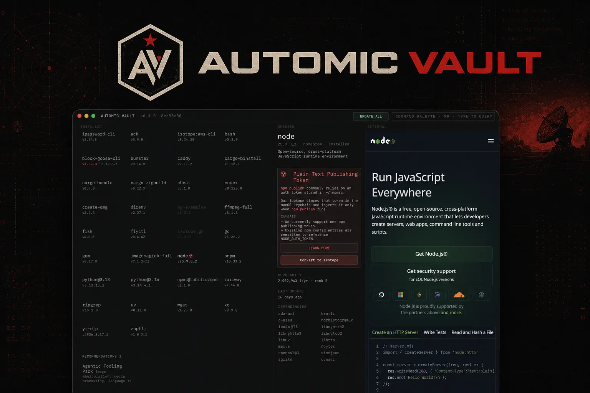

# Automic Vault

Package manager, secrets manager, and execution control plane for autonomous
agents.

> [!NOTE]
>
> - 20k⭐︎: We’ll add Linux support
> - 50k⭐︎: We’ll add Windows support

> [!IMPORTANT]
>
> Automic Vault is NOT AFFILIATED with any cryptocurrency or token.

&nbsp;

## What is This?

If you got here first then go here before continuing:
[www.automicvault.com](https://www.automicvault.com/).

&nbsp;

## Secure AI Agent Tooling

Automic Vault is a package manager, secrets manager, and approval gate system
for AI agents that run local developer tools. It is built for the moment where
an autonomous coding agent can read files, call command-line tools, and act
with credentials that were originally meant for a human.

Most agent security controls live inside the agent. Automic Vault puts the
boundary beneath the agent: the tools, packages, and secrets it tries to use.
Packages install under controlled roots, secrets stay out of plaintext files,
and sensitive commands can require human approval at execution time.

Use Automic Vault when you need:

- a package manager for AI agents that keeps installed tools harder to modify
- a secrets manager for AI agents that keeps credentials out of model context
- approval gates for commands such as package publishing, token reveal, and
  cloud mutation
- local protection for developer credentials used by GitHub CLI, AWS CLI,
  MCP servers, and other automation tools

Automic Vault is not a replacement for every enterprise secrets platform. It
is the local runtime layer that keeps agent sessions from casually reading or
misusing the credentials and tools already present on a developer machine.

&nbsp;

## SEO Pages

- [AI agent secret scanner](https://www.automicvault.com/secret-scanner-for-ai-agents/) — use `av secret-scanner` to check isotope detectors and local files for plaintext credentials before an agent run.
- [Secrets manager for AI agents](https://www.automicvault.com/secrets-manager-for-ai-agents/) — store credentials outside agent-readable files and inject them only into approved tools.
- [Secret scanning vs agent secret protection](https://www.automicvault.com/secret-scanning-vs-agent-secret-protection/) — explain why scanning and runtime prevention solve different parts of the exposure problem.
- [API key management for AI agents](https://www.automicvault.com/api-key-management-for-ai-agents/) — protect CLI, SDK, MCP, and automation tokens used by local agent workflows.

Target search language: AI agent secret scanner, secret scanner for AI agents,
secret scanning for coding agents, secrets manager for AI agents, and agent
secret protection.

&nbsp;

## Isotope Contributor Docs

- [General Isotope Guidelines](./docs/isotopes.md)
- [Radioisotope Considerations](https://github.com/automic-vault/radioisotopes/#readme)

Current radioisotope inventory as of 2026-05-15:

- 73 radioisotope manifests
- Homebrew popularity scan coverage through rank 4250
- 70 radioisotopes added from the Homebrew scan log
