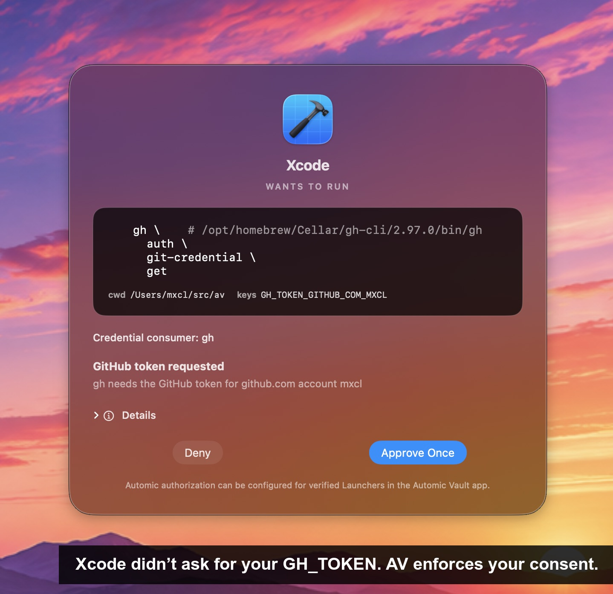
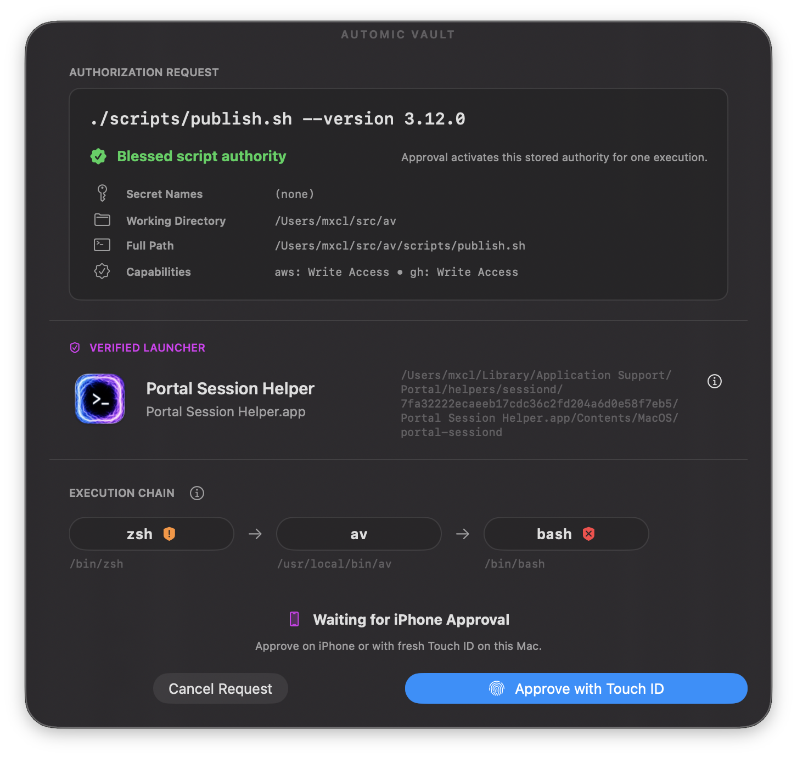
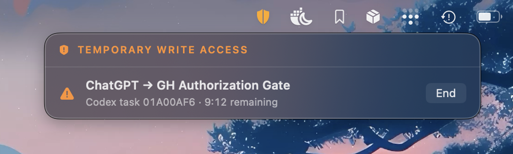

# Automic Vault [](https://outclaw.dev/automic-vault/automic-vault)

> Control how developer credentials are used.

## Quickstart

- Direct download: \
  https://github.com/automic-vault/automic-vault/releases/latest
- Homebrew:
  ```sh
  brew install --cask automic-vault/isotopes/automic-vault \
    && open /Applications/Automic\ Vault.app
  ```
- cURL one-liner:
  ```sh
  curl -fsSL https://www.automicvault.com/install.sh | bash && av open
  # ^^ read it first
  ```

> [!IMPORTANT]
> Automic Vault is not associated or affiliated with any cryptocurrency or “token”.

&nbsp;


## What is Automic Vault?

Automic Vault gives verified software bounded authority to apply developer credentials to specific operations. It protects developer credentials at two boundaries: where they are stored and where they are used. It finds credentials that any process running as you can retrieve from plaintext files, environment variables, permissive Keychain items, or credential-helper commands, then moves supported tools toward protected storage. It authorizes each credential operation according to the Verified Launcher, Target, command, and policy, or asks you when policy cannot decide.

The primary adversary is untrusted or compromised code already running with your normal user privileges: an agent, dependency, plugin, script, or supply-chain payload. Automic Vault builds on macOS code signing, Keychain, TCC, Hardened Runtime, and process identity, with you as the final authority. It does not claim to contain a root or kernel compromise, prevent arbitrary local destruction, or make a Target trustworthy after it receives a secret.

### How Automic Vault Differs

A retrieval-based secrets manager decides whether an identity may receive a
stored secret. Automic Vault decides whether a Verified Launcher may apply the
requested Secrets to a complete operation.

The Authorization Request binds the Gate Client, Target, command, arguments,
working directory, and selected Secret Value sources. Policy evaluates that
request on the Mac where it runs. Recognized operations can run automically;
other requests require Approval or fail closed.

With Read Only access, one GitHub token produces different decisions. Policy
allows `gh issue list`, requires Approval for `gh issue create`, and treats
`gh auth token` as Secret Disclosure. All three use the same credential; the
requested operation determines the authority required.

Automic Vault controls the handoff. After Secret Application, the Target
controls the Secret in its memory, helpers, child processes, and output.

### Automic Vault Is

- A secrets manager with granular access controls designed for developers that
  use agents and who are vulnerable to supply chain attacks.
- A realtime detector for secret exposure and configurations that may lead to
  secret exposure.
- A hardening manager for over 100 tool configurations, including AWS, GitHub,
  GitLab, and more. We move plaintext secrets into the macOS keychain and ensure
  the application of those secrets receives granular access control.
- Execution controls for sensitive developer operations, scoped to an
  Authorization Gate and a Verified Launcher.
- Zeroconf operation above the security boundary. Terminals, IDEs, agents,
  harnesses, and projects keep using their existing commands. They need no
  Automic Vault plugin or policy file.

### Automic Vault Is **Not**

- Not just guardrails: we’re a security layer underneath agents and all other
  command line tools†
- Not invasive. Automic Vault does not replace your shell or terminal and does
  not transparently intercept every process. It requires no configuration
  changes to your agents. Hardening is opt-in, minimal and applied per tool.
- Not protection against `rm -rf $HOME` or other destructive *local* commands.
  Automic Vault is not a security layer for UNIX.
  It is an adapter for the macOS GUI security model applied to the command line.
- Not a encrypted `.env` solution. We provide secure ways to provide secrets
  to solutions like [`dotenvx`] and [Varlock].

> † we patch tools to make them more secure and distribute them through our
> [homebrew tap] or directly through `av harden`. We install stubs in
> `/usr/local/bin` that federate access to
> secrets using the full breadth of the macOS security model, including
> code signing, notarization, XPC, TCC and the keychain.

[homebrew tap]: https://github.com/automic-vault/homebrew-isotopes
[`dotenvx`]: https://dotenvx.com
[Varlock]: https://varlock.dev

&nbsp;


> [!NOTE]
>
> # Why Automic Vault?
>
> Famously I elected to have Homebrew *not* require `sudo` for `brew install`. A
> controversial decision that was ultimately seen as acknowledging that
> developer environments and *system tools* are different and need different
> security models.
>
> That was then. When the only intelligence using your computer was you, the
> developer, it was reasonable to assume that you were the only one who could
> exfiltrate secrets from your local environment. This assumption is no
> longer valid.
>
> ## The Threat Model Has Changed
>
> <details>
> <summary>Supply chain attacks target plaintext secrets…</summary>
>
> - Supply chain attacks target plaintext secrets and other trivial exfiltration
>   mechanisms (eg. calling `gh auth token`)
> - Agents change the game. *No longer are we the only intelligence using our
>   computers.*
>
> Also crucially, Apple have made numerous improvements to the underlying security
> of macOS, eg.:
>
> - System Integrity Protection (SIP)
> - Hardened Runtime
> - Notarization
> - Gatekeeper
> - Privacy protections
> - App Sandbox
>
> **These security measures apply unevenly to command line tools.**
>
> An unsigned command inherits the security context of the `.app` that runs it,
> which for a developer is typically a terminal. A Developer ID-signed native
> executable can also provide its own verifiable launcher identity. TCC permissions
> still belong to the containing app.
> Most developers quickly bypass these protections because they
> are too inconvenient for a general purpose tool like a terminal.
>
> Automic Vault is the adapter that applies the macOS operating system’s
> security model to command line tools, while minimizing friction for the
> developer.
>
> </details>

&nbsp;


## How Does Automic Vault Work?

### Detection & Monitoring

```sh
av scan  # or open the app
```

Automic Vault detects over hundred developer tools configurations that either
lead to secret exposure or directly expose secrets. Some of these are well
known, eg. `gh auth token` or `aws configure list`, while others are more
subtle, for example many tools that claim to use the keychain are in fact
misconfigured and allow any tool that can run `/usr/bin/security` to exfiltrate
keys.

Once detected we provide you mitigation steps. Often you can just run a few
commands. But some tooling configurations require “hardening”.

### Hardening

```sh
av harden gh  # `av scan` tells what to harden
```

Hardening varies, but its purpose is:

- Encrypting plaintext secrets in the macOS Data Protection Keychain
- Provide granular access control for the applied use of those secrets based on
  the tool and the launcher that is running the tool†

> † This means you can have different access control for eg. your terminal and
> your agent.



Hardened tools gain an Authorization Gate in the app. Each gate has a default Access
Level and optional rules for specific Verified Launchers:

1. **Approval Required**: every operation needs your approval.
2. **Read Only**: recognized read-only operations are automically authorized.
   Homebrew omits this level because inspection commands may update Homebrew.
3. **Read & Update**: at the Homebrew Execution Gate, recognized read-only
   operations and `brew update` are automically authorized. Installs and
   upgrades still need approval.
4. **Local Write**: recognized read-only and local-write operations are
   automically authorized where the Tool supports this distinction.
5. **Write Access**: recognized read and write operations are automically
   authorized. Secret Disclosure and Elevated Secret Application still need
   approval.
6. **Full Access**: recognized sensitive secret operations may also be
   automically authorized. Unknown operations still need approval.

Hardened tools request secrets when they need them. Automic Vault releases those
secrets only when your gate policy allows it or you approve.

> [!IMPORTANT]
> Human approval is available only while your macOS user session is active and
> the screens are awake. Automic Vault aborts open approval windows and denies
> requests that still need a human decision when the session becomes inactive
> or the screens sleep. Retry when you return; stale approvals are not preserved.
>
> Requests already allowed by policy may continue without a prompt, subject to
> each secret’s **Available While Locked** setting.

> [!NOTE]
> For launcher-specific policy, we walk the process’s launcher chain, validate its code
> signature with macOS and match its designated requirement against the identity
> you approved. If we cannot verify that identity, automic authorization fails closed.
> Code signing proves identity and integrity—not good intentions. You still choose
> which launchers to trust.

### Launcher Bundles

Unsigned and ad-hoc-signed CLIs cannot normally become Verified Launchers.
They lack a stable publisher identity, and their original paths remain
user-writable, so ordinary Launcher admission rejects them.

For one regular Mach-O executable, open **Launcher Bundles** in Automic Vault.
Automic Vault snapshots the selected file, signs the payload and a minimal
launcher with Hardened Runtime, and enrolls that exact generation. Ad-hoc signing
is the default, so this does not require a paid Apple developer account.

**Install & Enroll** asks for administrator authorization once. It installs the
bundle under `/Applications/Automic Vault/` and creates
`/usr/local/bin/<command>` as a symbolic link to its launcher. You can then use
the command as before:

```sh
$ my-command --help
$ av doctor my-command
# ^^ verifies the Launcher Bundle link and PATH precedence
```

Automic Vault makes both the bundle and command link root-owned. An ad-hoc
signature detects changes but does not prevent them, and macOS does not promise
App Management protection for locally built app bundles. Without root ownership,
another process running as you could replace the program behind the command and
execute code before it makes a Vault request. A root-owned link alone cannot
protect a user-writable target.

Root ownership protects the installed command from ordinary same-user writes.
Automic Vault still revalidates the live code identity, nested signatures,
enrolled generation, payload digest, and runtime posture on every authorization.
Any change or re-signing hard-denies the request. The original executable
remains separate and unverified.

Launcher Bundles establish identity and integrity for the exact packaged code.
They do not establish publisher trust or make the CLI safe. Scripts and
directory-shaped tools are not supported. See
[Signed CLI Launchers](docs/signed-cli-launchers.md) for the full requirements
and update behavior.

### Using Automic Vault as a General Secrets Manager

```sh
$ av save TOKEN_NAME
# Confirmation window appears

$ av save --project-directory=. TOKEN_NAME
# Store a Project Value for the current physical directory

$ av list
# Approval window appears unless the calling app is allowed in Settings

$ av inject +TOKEN_NAME -- /bin/bash
# Approval window appears
```

Automic Vault differs from conventional secrets managers in two ways:

- Secrets have granular access control based on each tool and its use
- Tools have granular access *levels* tuned to each tool’s capabilities

`av inject` as the shebang for scripts creates a script that always shows an
approval window when run. The script receives the secrets if you approve its
runtime request.

Each Secret Name may have a Global Value and Project Values. For each requested
name, `av inject` selects the nearest Project Value at or above its working
directory, then falls back to the Global Value. Project directories select a
value; they do not grant authority. Existing name-based policy covers every
Value of that Secret.

> [!TIP]
> #### Portable Scripts
>
> ```sh
> #!/bin/sh
>
> if [ -x /usr/local/bin/av ] && [ -z "${API_TOKEN:-}" ]; then
>   exec /usr/local/bin/av inject --replace-existing-env +API_TOKEN -- /bin/sh "$0" "$@"
> fi
> : "${API_TOKEN:?set API_TOKEN or install Automic Vault}"
> ```

#### Blessed Scripts



In order for a script to have granular execution and access control it must be
blessed:

```sh
$ av bless ./scripts/my_script.sh
# Blessing window appears
```

By default, Blessing does not endorse the Launcher for automic authorization.
Pass `--endorse-launcher` to include a Launcher Endorsement in the review.
`--endorse-caller` remains a compatibility alias.

A Script Declaration may include per-Gate Capabilities. This lets one Blessing
cover the script's reviewed Secret Names and operations. This script needs
`APPLE_PASSWORD`, Read Only access to `gh`, and Write Access to `aws`:

```sh
#!/usr/local/bin/av inject +APPLE_PASSWORD -- /bin/bash
# --- automic-vault
# capabilities:
#   gh: read-only
#   aws: write
# ---
```

Blessing binds the canonical path, exact file contents, and complete Script
Declaration. Editing the script invalidates the Blessing and requires another
review.

Launcher Endorsement can make the exact Blessed Script automically authorized
for a specific Verified Launcher.

> [!NOTE]
> Blessed Scripts are designed for well-defined usage scenarios: they run a
> reviewed set of steps and then exit, so you can reason about which Tools they
> run and where they apply Secrets. Do not use them to inject Secrets into
> long-running Tools. Use Authorization Gates with Verified Launchers:
> [Hardened Tools](#hardening) for long-running use, or Blessed Scripts for
> bounded automation. In rare cases, add Direct Access Rules for exact Secret
> Names and specific Verified Launchers.

> [!TIP]
> Allowing specific signed launchers is powerful but requires careful
> consideration. Potential uses:
>
> - Keeping all hardened tools at read-only or lower and only defining use of
>   those tools via immutable blessing is truly a level of safety developers
>   have only ever dreamed of.
> - Having a single terminal app that is the only one used for deployments and
>   the only launcher that is endorsed to run them (and never using it for
>   anything else)
> - Or conversely, trusting your agents more than your terminal (where supply
>   chain attacks are more likely to occur).

> [!NOTE]
> Blessed Scripts normally run from a verified snapshot to avoid races between
> Approval and potential file edits. Most Targets receive a `/dev/fd/N` path.
> When an interpreter cannot execute that path, Automic Vault warns during
> blessing and on every run, then uses the canonical script path if the user
> chooses to bless anyway. Another process can change the file after Automic
> Vault verifies it and before the interpreter opens it. Existing Blessings must
> be reviewed again to accept this exception. `$0` is not normally
> the original file path. Automic Vault sets `AV_SCRIPT_PATH` to the canonical
> path and `AV_SCRIPT_DIR` to its containing directory. Use `AV_SCRIPT_DIR` to find
> files relative to the script, or `${AV_SCRIPT_PATH:-$0}` when compatibility
> with systems without `av` is desired.

### Blessing Agent Automations

Create a Blessed Script whose reviewed steps and Script Declaration precisely
map the actions an automation requires. From the agent harness, bless that
script and include a Launcher Endorsement:

```sh
$ av bless --endorse-launcher ./scripts/my_automation.sh
```

The Launcher Endorsement gives that Verified Launcher automic authorization
only for the exact Blessing. Editing the script or its Script Declaration
invalidates the Blessing.

### Project Secrets (`.env` files)

[dotenvx](https://dotenvx.com) keeps encrypted secrets in `.env` files. Store
its decryption key in Automic Vault instead of leaving `.env.keys` in your
project:

```sh
$ av save --project-directory=. DOTENV_PRIVATE_KEY
# Paste DOTENV_PRIVATE_KEY from .env.keys
```

Add a project script using `av inject` with `dotenvx run` in its shebang. For
example, `scripts/build-env`:

```sh
#!/usr/local/bin/av inject +DOTENV_PRIVATE_KEY -- /usr/local/bin/dotenvx run -- /bin/sh

exec node ./scripts/build.mjs "$@"
```

`av` applies the decryption key to dotenvx after authorization. dotenvx then
decrypts `.env` and injects its values into the command’s environment.

Point `package.json` at the executable script:

```json
{
  "scripts": {
    "build:env": "./scripts/build-env"
  }
}
```

Make the script executable, then bless it and endorse the current verified app
Launcher in the same review:

```sh
$ chmod +x ./scripts/build-env
$ av bless --endorse-launcher ./scripts/build-env
# Review the exact script and current Launcher in Automic Vault

$ npm run build:env
```

`--endorse-launcher` adds a Launcher Endorsement for the verified app running
`av bless`. To endorse another app Launcher, open **Blessed Scripts** in
Automic Vault, select the script, then click **+** (**Add Calling App**).
Endorse the app that starts `npm run`, such as Terminal or the Codex app, not
`npm` itself.

The Authorization Gate still verifies the exact Blessing and Launcher identity
on every run. Policy automically authorizes a match without an Approval prompt.
If you edit the script, run `av bless` again to review the changed contents.

&nbsp;


## AWS & Docker Without Ambient Credentials

```sh
$ av harden aws
$ aws sts get-caller-identity
# ^^ temporary credentials, issued for this exact aws process
```

`av harden aws` moves your default access key pair out of
`~/.aws/credentials`, stores it in the macOS Keychain, and installs a native
credential helper. Each `aws` invocation registers its arguments, profile,
process identity, and config with the app. The helper answers only the immediate
child of that registered, still-running process.

Normal commands receive short-lived STS credentials. MFA and role profiles work
without writing a session cache to disk. Commands that AWS requires long-lived
keys for, including some IAM and STS operations, receive them only after the
approval window presents a large Elevated Secret Application warning. Your
normal Secret Gate Access Levels still apply; **Full Access includes the
original reusable credentials**.

> [!IMPORTANT]
> AWS hardening supports a narrow profile model on purpose: the imported
> `default` keys, regions, MFA, and roles rooted at `default`. Other credential
> providers fail closed. `av harden aws` installs and verifies AWS's signed,
> notarized, Hardened Runtime CLI under `/opt/av/aws`; it does not depend on
> Homebrew.

[Read why we think this is the best AWS credential manager in the world.](https://www.automicvault.com/blog/best-aws-credential-manager/)

Docker gets the same ambient-access fix without replacing Docker Desktop's
vendor-signed, Hardened Runtime CLI:

```sh
$ av harden docker
$ docker pull registry.example/acme/image
# ^^ registry credentials, released only to this verified Docker process
```

`av harden docker` migrates credentials from Docker's existing helper into
Secret Custody, installs a root-owned
`/usr/local/bin/docker-credential-av` only when every containing directory is
root-owned and protected from group/world writes, and updates Docker's
`credsStore`. The Secret Gate verifies the live Docker process's signature,
Hardened Runtime, ancestry, arguments, and requested registry before releasing
the credential.

> [!IMPORTANT]
> Docker's credential-helper protocol necessarily returns a usable registry
> token to the authorized Docker process as plaintext JSON. Automic Vault
> keeps it in Secret Custody at rest and prevents ambient access; it cannot make
> a compromised authorized Docker process keep that token confidential.

&nbsp;


## How Much Friction is This?

As little as possible!

But we aren’t going to lie: it’s more friction than now. We minimize:

- How invasive Automic Vault is.
  - Mostly we install wrappers that change as little as possible.
  - Though when security requires more, we say so: AWS hardening uses a native
    credential helper to convert your too-powerful AWS keys into short-lived
    session tokens for each invocation.
  - Some tools need more, so we patch them and let `av harden` install the
    signed Isotope directly or through Homebrew (`gh`, `stripe`, `supabase`
    etc.). We try to upstream these patches.
- We make approval gates rare and specific.
  - By default, Secret Gates automically authorize recognized read-only commands.
  - Writes and sensitive secret operations require Approval unless the chosen
    Access Level permits them.
  - Once you get used to that we recommend playing with the levels, eg.
    requiring human approval for *everything* but one Terminal and your agent apps.
  - We also try to be smart, eg. `gh` even decodes GraphQL queries to determine
    what safety rating need to be applied.

&nbsp;


## Important Notes When Using Automic Vault With Agents

Automic Vault ties approval gates to signed launcher identities. This includes
both app bundles and Developer ID-signed standalone executables.

The current official macOS installers we checked for
[Claude Code](https://github.com/anthropics/claude-code) and
[Codex](https://developers.openai.com/codex/cli/) ship Developer ID-signed
native executables. This is true of their recommended standalone installers
and Homebrew casks. Their current npm packages also contain the signed native
payload: Claude installs it as the command while Codex starts it through a Node
wrapper. For the clearest process identity and `av doctor` result, prefer the
standalone installer or Homebrew cask.

Run `av doctor claude` or `av doctor codex` to check the command selected by
your current `PATH`. Distribution details can change; the doctor verifies the
live executable rather than trusting how it was installed.

See [Signed CLI Launchers](docs/signed-cli-launchers.md) for requirements,
setup, and failure behavior.

### Temporary Write Access for Agent Tasks



When a recognized Codex task or Claude Code session makes an eligible write
request, the Approval window can offer **Allow Write Access for 10 Minutes…**.
This creates an in-memory Temporary Access Grant for that exact Verified
Launcher, Tool-specific Authorization Gate, runtime posture, and agent task.
Recognized read and write operations at that scope can proceed without another
Approval until the grant expires or you click **End**.

The persistent strip keeps every active grant visible. Grants also end when the
user session becomes inactive, the displays sleep, an update begins, or Automic
Vault stops.

> [!IMPORTANT]
> The agent task identifier narrows a grant but is not identity or a security
> boundary; the Verified Launcher remains the identity boundary. Temporary
> Access Grants never cover the Direct Secret Gate, Secret mutations, Elevated
> Secret Application, Secret Disclosure, or Unknown operations.

It is then vital to ensure the harness for the agents has minimal TCC
permissions. If you are using them via CLI that will often be your Terminal

> [!IMPORTANT]
> It is time to go into System Settings and turn off everything you let your
> Terminal do before because it was too tedious not to!
>
> Our suggestion is one terminal for things that may have supply chain attacks
> and one for everything else. The former should be locked down! And yes: this
> means an entirely different app, not just a different version installed to
> a different location. **TCC gates apply to bundle IDs!**
>
> Especially disable:
> - Full Disk Access
> - Modify Other Applications

macOS has come a long way since these OS level permission gates were tedious:
they are quite granular nowadays. And coupled with Automic Vault, they are a
powerful tool to protect your secrets, prevent malware having attack
opportunities and prevent agents from being too dangerous.

> [!IMPORTANT]
> Unsigned and arbitrary ad-hoc signed executables cannot be launcher identities.
> For one Mach-O CLI, Automic Vault can create an enrolled **Launcher Bundle**
> whose exact signed generation and payload are revalidated on every request.
> See [Launcher Bundles](#launcher-bundles).

### Pi

Pi’s official macOS v0.83.0 standalone binary is linker/ad-hoc signed and has no
Team ID, so Automic Vault rejects the original executable as a launcher. Use
Automic Vault's **Launcher Bundles** sidebar to package a supported single-file
Mach-O release without requiring a paid Apple developer account.

Review the source and release digest before creating the bundle: packaging
establishes exact executable identity and integrity, not publisher trust or
safe behavior.

### Computer Use & Automic Vault

Computer Use could be used by agents (or malware!) to approve Automic Vault gates.

We provide an iPhone app to mitigate this potential attack vector. The iPhone
app is a companion to Automic Vault that allows you to move Automic Vault gates
from your Macs to your Phone. This way, even if an agent or malware wanted to
approve a request itself, they cannot.

&nbsp;


## Other Links

- [User Manual](https://www.automicvault.com/docs/)
-  The authoritative project vocabulary and security boundaries live in
  [Domain Language](docs/domain-language.md), [Architecture](docs/architecture.md),
  and the [architecture decisions](docs/adr/).
- [Documentation Index](docs/index.md)
- [Ephermeral Chat](https://outclaw.dev/automic-vault/automic-vault)
